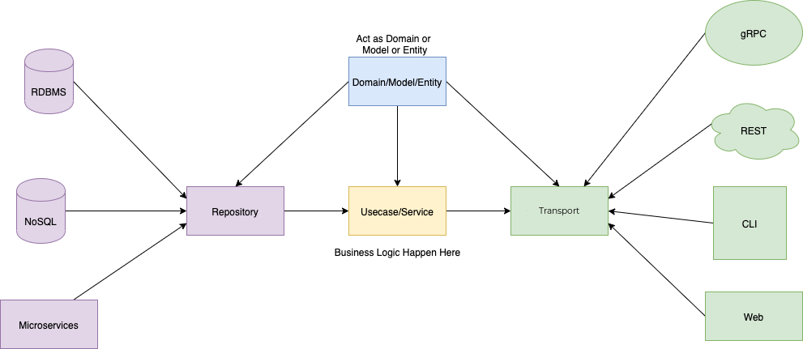

# alif-task

## Overview

This project utilizes several libraries and tools to provide a REST API service. Below, you'll find information about the project structure, dependencies, and how to run it using Docker.

### Project Diagram



## Getting Started

To start the service using Docker, make sure you have Docker and Docker Compose installed.

### Starting the Service

Use the following command to start the application in Docker:

```bash
docker compose up
```

All environment configurations are stored in the `app.env` file.

### Documentation

- [Swagger documentation](http://localhost:8080/swagger/index.html#/)
- [Redoc documentation](http://localhost:8080/redoc)

### Packages

This project utilizes several packages and libraries:

- Rest API framework: [Gin-gonic](https://gin-gonic.com/)
- Database: [Gorm](https://gorm.io/index.html)
- Logging: [Uber Zap](https://github.com/uber-go/zap)
- JWT token handling: [JWT](https://github.com/dgrijalva/jwt-go)
- Mock testing: [Go-mock](https://github.com/golang/mock)
- Redis: [Go-redis](https://github.com/redis/go-redis)
